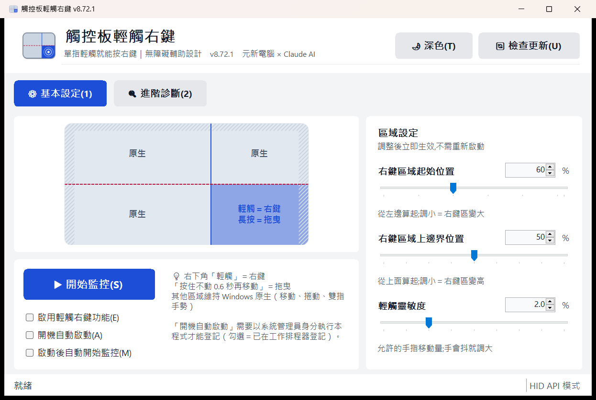
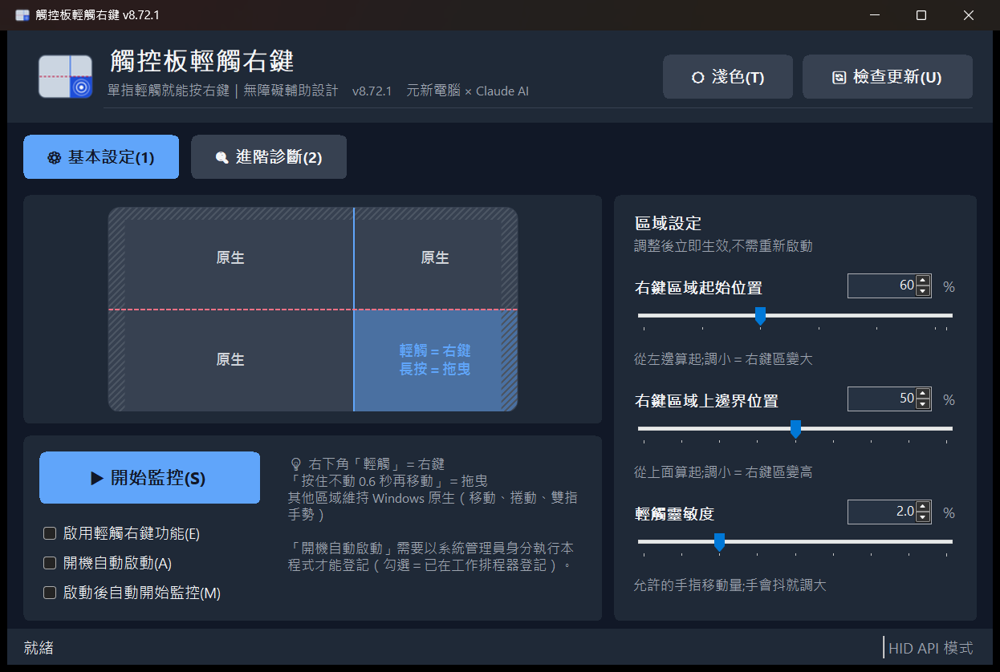
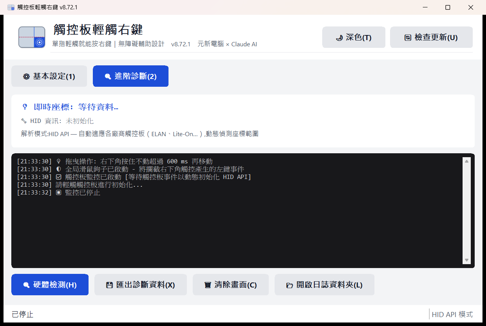

<picture>
  <source media="(prefers-color-scheme: dark)" srcset="docs/assets/logo-banner-dark.png">
  
</picture>

# TouchpadTapRight ｜ 觸控板輕觸右鍵
> **輔助科技工具 — 為只能用一隻手指輕觸觸控板的使用者設計**

[](LICENSE)
[](https://dotnet.microsoft.com/)
[](https://www.microsoft.com/windows)
[](https://github.com/nec789tw/touchpad-tap-right/releases/latest)

---

## ⚠️ 使用前請先看（很重要）

1. **這是社群測試中的版本。** v8.70 起的觸控核心修正（見下方「版本說明」）通過了兩輪獨立程式碼審查，但**實機驗證有限**——觸控板廠商、韌體、筆電型號差異很大，我們沒辦法保證每一台都順利。你的回報就是驗證。
2. **不對勁就先切回舊版**：[v8.69-legacy](https://github.com/nec789tw/touchpad-tap-right/releases/tag/v8.69-legacy) 是大改之前、客戶實際在用的版本。新版怪怪的 → 換回舊版試同一個動作 → 兩邊都做一次再回報，我們才知道是新版的問題還是本來就這樣。
3. **回報很簡單**：進階診斷頁「📂 開啟日誌資料夾」→ 把 `app.log` 貼到 [Issue](https://github.com/nec789tw/touchpad-tap-right/issues/new/choose)（範本會引導你）。日誌裡已經有版本、Windows 版本、觸控板 HID 結構，不用自己查。
4. **參數可以自己調**：拖曳門檻、輕觸時間、邊緣保護……全部在 `config.json`（見下方），改文字檔重開程式就生效。調到順手的值請回報，我們會改成預設值。
5. **SmartScreen 會警告**「未知的發行者」（我們沒買憑證），選「其他資訊 → 仍要執行」。
6. **建議以系統管理員身分執行**，否則對「以系統管理員執行」的視窗無法送出右鍵、「開機自動啟動」也無法登記。
7. **關閉視窗＝結束程式**（目前沒有系統匣圖示），請最小化不要關。

## 這是什麼

- 👤 **使用者情境**：身障者狀況不一，共通點是**只能用一隻手指輕觸觸控板**，無法按壓實體鍵、無法雙指手勢。
- ❌ **問題**：新筆電（Windows 11 + Precision Touchpad）沒有「輕觸右下角＝右鍵」的選項。
- ✅ **解法**：本程式用 Windows Raw Input + HID API 直接讀觸控板座標，**右下角輕觸 → 送出右鍵**，其他區域完全交回 Windows 原生處理。

## 功能（以 v8.72 原始碼為準）

| 動作 | 效果 | 門檻（`config.json` 可調） |
|---|---|---|
| 右下角**快速輕觸** | 滑鼠右鍵 | 觸點停留 < 300 ms、移動 < 2% |
| 右下角**按住不動** | 進入拖曳模式（按住左鍵，之後移動即拖曳） | 停留 > 600 ms、期間移動 < 6% |
| 其他三個象限 | 不干預，Windows 原生 | — |
| 觸控板四周邊緣 | 不動作（防誤觸） | 左右 4%、上 6% |

- **HID API 動態解析**：自動讀取觸控板的 X/Y 範圍與 LinkCollection，不寫死廠商參數；已實測 ELAN、Lite-On。
- **設定會記住**：三條滑桿（右鍵區域起始位置、上邊界、輕觸靈敏度）改了立即生效並存檔。
- **開機自動啟動**：勾一下就登記到工作排程器（登入時以最高權限執行、不會再問 UAC）；免安裝，取消勾選即刪除登記。搭配「啟動後自動開始監控」，開機後什麼都不用按。
- **即時預覽**：觸控板視覺化，看得到右鍵區、邊緣保護帶、觸點與觸發位置；隨視窗縮放。
- **進階診斷**：硬體檢測（列出 HID Value Caps）、即時座標／Confidence／ContactID、匯出診斷 txt。
- **寫檔日誌**：`%LOCALAPPDATA%\TouchpadTapRight\logs\app.log`（只記狀態事件與錯誤，不記逐筆座標；1 MB 滾動、留 2 份）。
- **檢查更新**：主畫面「🔄 檢查更新」向 GitHub Releases 比對版本，有新版就帶你到下載頁。
- **淺色／深色**：標題列一鍵切換（自動重啟、跳過歡迎視窗、恢復監控），預設跟隨 Windows；大按鈕（≥44px）、Alt 快捷鍵、螢幕閱讀器名稱；DPI 縮放。
- **低延遲**：輕觸到右鍵約 50 ms。

## 畫面

| 基本設定（淺色） | 基本設定（深色） |
|---|---|
|  |  |



淺色／深色：標題列右上「🌙 深色／☀ 淺色」按一下就切換（程式會自己重開 1–2 秒，跳過歡迎視窗，原本在監控會自動恢復——只需按一下）。預設跟隨 Windows「個人化 → 色彩」；`config.json` 的 `"Theme"` 也可設 `"system"`／`"light"`／`"dark"`。

### 已知限制
- 沒有系統匣圖示：**關閉視窗＝結束程式**，請最小化。
- 沒有快捷鍵、沒有聲音提示。
- 「開機自動啟動」記的是 exe 的路徑：把 exe 搬走後下次啟動程式會自動修正登記，但**搬走後直到你手動再開一次程式之前，開機不會自啟**。
- Synaptics、Alps 等其他廠商觸控板：理論上 HID API 可解析，但未實測。

## 下載與執行

1. 到 [Releases 最新版](https://github.com/nec789tw/touchpad-tap-right/releases/latest) 下載 `TouchpadTapRight-vX.XX-win-x64.exe`（單一檔案，已內含 .NET 9 Runtime，約 50 MB）。
2. 放到固定位置（要用「開機自動啟動」的話請放 `C:\Program Files\TouchpadTapRight\`——見下方安全說明），右鍵 exe → **以系統管理員身分執行**。
3. 第一次啟動會跳出操作說明視窗，按確定進入主畫面。
4. 按「▶ 開始監控」→ 用一根手指輕觸觸控板右下角。順手的話勾「開機自動啟動」＋「啟動後自動開始監控」。

### 系統需求
- Windows 10 (Build 19041) 以上，建議 Windows 11。
- 任何觸控板；Precision Touchpad（Windows 內建 HID 驅動）相容性最好。

## 設定檔 `config.json`

位置：`%LOCALAPPDATA%\TouchpadTapRight\config.json`（第一次啟動自動建立）。改完存檔、重開程式生效；刪掉即回預設。

| 欄位 | 預設 | 說明 |
|---|---|---|
| `RightZoneStartX` | 0.6 | 右鍵區從左邊 60% 開始（＝主畫面滑桿，會自動同步） |
| `VerticalSplitY` | 0.5 | 右鍵區從上面 50% 開始（＝滑桿） |
| `TapDistanceThreshold` | 0.02 | 輕觸允許的移動量 2%（＝滑桿） |
| `Theme` | "system" | 外觀："system" 跟隨 Windows、"light" 淺色、"dark" 深色（標題列按鈕會改這個值） |
| `AutoStartMonitoring` | false | 程式啟動後自動按「開始監控」（＝勾選） |
| `TapTimeMs` | 300 | 停留超過這個時間就不算輕觸 |
| `DragHoldMs` | 600 | 按住多久進入拖曳 |
| `DragMoveTolerance` | 0.06 | 進入拖曳前允許的移動量 6%——**手抖大就調大，慢速移動誤觸拖曳就調小** |
| `TouchEndTimeoutMs` | 100 | 多久沒有新資料視為手指離開 |
| `EdgeLeftRatio` / `EdgeRightRatio` / `EdgeTopRatio` | 0.04 / 0.04 / 0.06 | 邊緣保護帶寬度 |

比例都是 0.0–1.0，時間毫秒。亂填會被夾回合理範圍。

## 社群測試指南

觸控板型號太多，我們最需要的就是不同機器的回報。請照 [docs/測試指南.md](docs/測試指南.md) 的 7 個動作各做一次（新版與 v8.69-legacy 各一次最好），把結果貼進 Issue。

## 從原始碼編譯

需求：.NET 9 SDK（Visual Studio 2022 17.12+ 或 VS Code 皆可）。

```bash
git clone https://github.com/nec789tw/touchpad-tap-right.git
cd touchpad-tap-right/CSharp/TouchpadRightClick
dotnet publish -c Release -r win-x64
# 產出：bin/Release/net9.0-windows/win-x64/publish/TouchpadTapRight.exe
```

csproj 已設定 `PublishSingleFile` + `SelfContained`，不用再加參數。

## 發佈新版本（維護者）

版本號的**單一來源**是 `CSharp/TouchpadRightClick/TouchpadRightClick.csproj` 的 `<Version>`；視窗標題、檢查更新、Release 資產名都由它推導。

```bash
# 1. 改 csproj <Version>8.73</Version>，commit
# 2. 打 tag 並推上去（tag 必須跟 <Version> 一致，workflow 會檢查）
git tag v8.73
git push origin main --tags
```

`.github/workflows/release.yml` 會在 `windows-latest` 上 `dotnet publish`，把 exe 以 `TouchpadTapRight-v8.73-win-x64.exe` 上傳到 GitHub Release，並自動產生 release notes。使用者端的「檢查更新」下一次按就會看到新版本。

## 版本說明（v8.70 起）

| 版本 | 內容 |
|---|---|
| v8.72 / v8.72.1 | 設定檔（滑桿持久化＋進階參數）、開機自動啟動、.NET 9（深色原生控制項）、小螢幕可捲動、logo（含視窗圖示）、v8.69-legacy 保險版、測試指南 |
| v8.71 | 寫檔日誌、改名 TouchpadTapRight、WinForms UI 翻新（無障礙、深色模式、DPI） |
| v8.70 | 兩輪 code review 修 11 個 bug（觸控結束偵測回 UI 執行緒、拖曳要按住不動、Stop 補送 LeftUp、多筆 report、hDevice 綁定、邊緣死區…）、檢查更新、GitHub Actions 自動發布 |
| v8.69-legacy | 大改之前的版本（保險用） |

細節與程式碼證據見 [docs/工作狀態.md](docs/工作狀態.md)。

## 專案結構

```
CSharp/TouchpadRightClick/        （C# 命名空間與資料夾維持 TouchpadRightClick，只有對外名稱改為 TouchpadTapRight）
├─ Program.cs                 入口：單一實例 Mutex、啟動說明、例外攔截、深色模式
├─ Core/
│  ├─ TouchpadMonitor.cs      註冊 Raw Input (UsagePage 0x0D / Usage 0x05)、WM_INPUT 訊息泵、狀態機
│  ├─ HidApiParser.cs         HidP_* 解析 PreparsedData → 正規化座標
│  ├─ TapZoneDetector.cs      區域判定、輕觸／長按拖曳辨識（所有門檻預設值在此）
│  ├─ MouseSimulator.cs       SendInput 模擬右鍵／左鍵拖曳
│  └─ GlobalMouseHook.cs      WH_MOUSE_LL：抑制驅動同時送出的誤觸左鍵
├─ UI/
│  ├─ Theme.cs                色票（淺／深）、字級、按鈕工廠、圓角、深色標題列
│  ├─ ModernMainForm.cs       主視窗（設定／診斷／檢查更新／自啟）
│  └─ SimpleTouchpadPreview.cs 觸控板即時預覽（響應式、邊緣保護帶）
└─ Utils/
   ├─ AppSettings.cs          config.json 讀寫與套用
   ├─ AutoStart.cs            工作排程器登記／取消／路徑修正
   ├─ FileLogger.cs           寫檔日誌（背景執行緒）
   ├─ HidDiagnostic.cs        HID Value Caps 列舉
   └─ UpdateChecker.cs        GitHub Releases 版本比對
docs/
├─ 交接手冊.html              ★ 由 tools/產生交接網頁.py 產生，開這份最快進入狀況
├─ 未完成盤點總表.md          還有什麼沒做（附程式碼證據）
├─ 工作狀態.md                完成軌跡與決策
├─ 測試指南.md                社群測試 7 步
├─ architecture.md            架構、資料流、相容性
└─ assets/                    logo（svg／png／橫幅）與畫面截圖，tools/make_logo.py 產生
```

架構細節見 [docs/architecture.md](docs/architecture.md)；接手開發請先開 [docs/交接手冊.html](docs/交接手冊.html)。

## 常見問題

**Q：輕觸沒有反應？**
1. 確認已按「開始監控」（狀態列顯示「監控中」）。
2. 觸點要在右下角象限（右鍵起始位置右邊、上邊界下面）；把起始位置調小可擴大區域。預覽圖斜線區是邊緣保護帶，那裡不動作。
3. 手指移動超過閾值會被當成滑動而非輕觸；把「輕觸靈敏度」調大。
4. 開「進階診斷」看座標有沒有在動；沒有的話按「硬體檢測」，把結果連同 `app.log` 回報。

**Q：拖曳進不去／一直誤進拖曳？**
`config.json` 的 `DragMoveTolerance`：手抖進不去就調大（0.08–0.10），慢速移動被當拖曳就調小（0.04）。`DragHoldMs` 是要按多久。

**Q：為什麼建議管理員權限？**
Windows 不允許一般權限的程式對「以系統管理員執行」的視窗送出輸入（UIPI），全域滑鼠鉤子也可能被拒，「開機自動啟動」的最高權限登記也需要。程式本身不主動要求提權。

**Q：開機自動啟動是怎麼做的？會裝東西嗎？**
不裝東西。它在 Windows 工作排程器登記一筆「登入時、以最高權限、執行這個 exe /autostart」（等同 `schtasks /Create /SC ONLOGON /RL HIGHEST`）。取消勾選就刪掉那筆，exe 刪掉就乾淨。排程帶起來的那次會跳過歡迎視窗、失敗只在狀態列提示，配合「啟動後自動開始監控」可以完全無人值守。

**⚠ 安全說明**：這筆排程會以**最高權限**執行那個 exe。如果 exe 放在一般使用者可寫的位置（下載、桌面、`D:\` 根目錄的自建資料夾…），任何以你身分執行的程式都可以把它換掉、下次登入就拿到管理員權限。所以要用開機自動啟動請把 exe 放到 `C:\Program Files\TouchpadTapRight\`（一般程式寫不進去）；程式在 exe 位於下載／桌面時會提醒。

**Q：會影響其他手勢嗎？**
不會。只在右下角象限的輕觸／長按動作介入，其餘全部交回 Windows。

**Q：怎麼回報問題？**
[開 Issue](https://github.com/nec789tw/touchpad-tap-right/issues/new/choose) 附上 `%LOCALAPPDATA%\TouchpadTapRight\logs\app.log`（進階診斷頁「開啟日誌資料夾」）＋一句話描述；範本會引導。

## 隱私與安全

- 平常**完全離線**，不收集、不上傳任何資料；日誌與設定只在你的電腦上。
- 只有按「檢查更新」時才連 `api.github.com` 讀公開的版本資訊。
- 原始碼公開，MIT 授權。

## 授權

MIT License — Copyright (c) 2025-2026 元新電腦，詳見 [LICENSE](LICENSE)。第三方引用見 [ATTRIBUTION.md](ATTRIBUTION.md)。

## 致謝

- **社團法人宜蘭縣脊髓損傷者協會**
- **宜蘭楊士芳進士文化發展協會**
- **原始鳥熊 Obb Studio**
- **Jason Chien ([jason5545](https://github.com/jason5545))** — GestureState 狀態機、Hysteresis 與可取消輕觸等設計貢獻
- **Microsoft** — Windows HID API / Precision Touchpad 文件
- [emoacht/RawInput.Touchpad](https://github.com/emoacht/RawInput.Touchpad) — HID API 解析、LinkCollection 遍歷策略
- [ichisadashioko/windows-touchpad](https://github.com/ichisadashioko/windows-touchpad) — HID API 使用範例（MIT）
- [jrymk/precision-touchpad-advanced-gestures](https://github.com/jrymk/precision-touchpad-advanced-gestures) — 手勢處理概念（GPL-3.0，僅參考概念未複製程式碼）
- **Claude（Anthropic）** — 開發協作、代碼審查、文件撰寫

## 這個工具是怎麼來的

一位只能用一隻手指操作觸控板的客人，到門市說他按不了右鍵。市面上找不到現成解法，就自己寫了一支。
客人用了之後持續回饋，改過好幾版，到現在還在用。

完整緣由與後續：[元新電腦 — 真實案例分享](https://yuanxintec.com.tw/cases/)

---

**適用對象**：手部精細動作困難者｜單指操作需求者｜觸控板按鍵損壞者

**維護者**：[元新電腦](https://yuanxintec.com.tw)（[nec789tw](https://github.com/nec789tw)）
